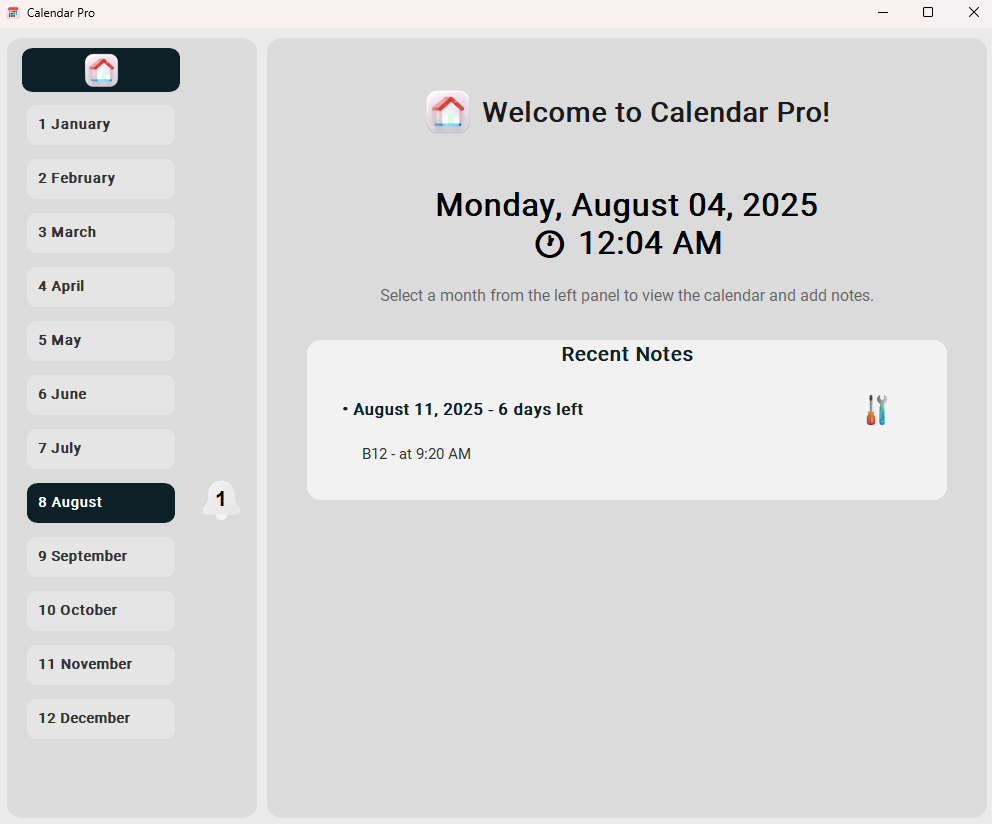
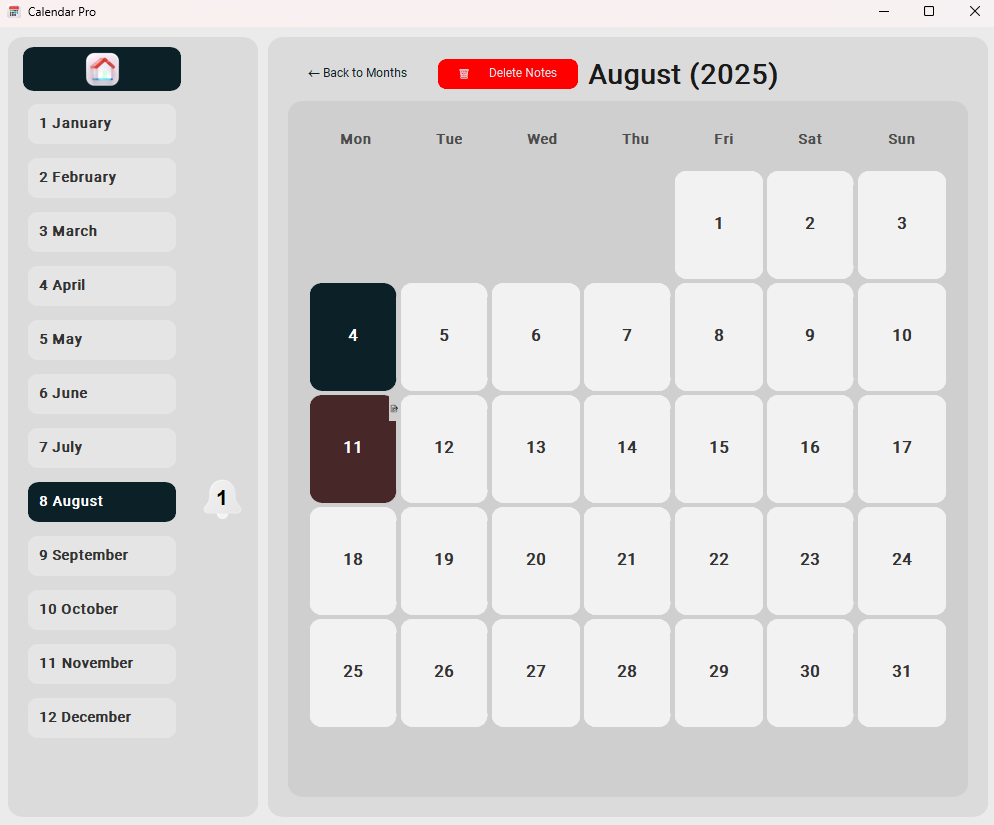

# Calendar Pro

A anti-modern desktop calendar application with a self imagined approach to month layouts and notes management. Found that most calander layouts on websites and apps we're unintuative to use. Built with Python and CustomTkinter, Calendar Pro prioritises intuitive month navigation over traditional calendar grids/layouts.

> I might just be slow for calendar apps, but this app works like a charm for me



## Features

- **Unique Month Layout**: Vertical month list for quick navigation instead of traditional grid
- **Intuitive Calendar View**: Clean, modern display when you select a specific month
- **Smart Note Management**: Add, edit and delete notes with countdown indicators
- **Local Data Storage**: All notes securely stored in local `notes.json` file (Planning to add an option to store on onedrive/set location to have cross device sync)
- **Mass Delete**: Select and remove multiple notes at once
- **Responsive Design**: Adapts beautifully to different window sizes

Current date is 4th August, that current day shows up highglighted, notes on specific days are shown in a maroon color.


## Installation

1. **Install Python** (if not already installed)

   - Download from [python.org](https://python.org)

2. **Install dependencies**:
   ```bash
   pip install -r requirements.txt
   ```

## Usage

1. **Run the application**:

   ```bash
   python calendar_app.py
   ```

2. **Using the app**:
   - **Left Panel**: Click on any month to view its calendar
   - **Home Button**: Return to welcome screen

- **Calendar View**: Click on any day to add/edit notes
- **Note Counters**: Shows the number of notes for each month
- **Delete Mode**: Select multiple days with notes to delete them at once
- **Edit Window**: Edit notes in a dedicated pop-up window

## File Structure

```
Calender/
├── calendar_app.py    # Main application
├── calendar.ico       # App icon
├── house.ico          # Home icon
├── icon.png           # Notification icon
├── edit.png           # Edit button icon
├── requirements.txt   # Python dependencies
├── README.md          # This file
└── notes.json         # Notes storage (excluded from GitHub)
```

## Features in Detail

### Unique Month Navigation

- Innovative vertical month layout for better user experience
- Months are displayed in a clean list with their numbers (1 January, 2 February, etc.)
- Current month is highlighted automatically
- Visual note counters show exactly how many notes each month contains
- Home button for quick return to the welcome screen

### Smart Calendar Layout

- Modern calendar grid when you select a month
- Days with notes are highlighted with a distinctive colour
- Current day stands out with a different highlight colour
- Note indicators (📝) appear on days with notes
- Intuitive back navigation to the month list

### Advanced Note Management

- Edit notes directly in the app or in pop-up windows
- Mass delete feature for removing notes from multiple days at once
- Countdown indicators showing days remaining or past for each note
- Recent notes displayed on the home page with preview text
- Success confirmation when notes are saved

### Clean and Modern Design

- Beautiful rounded corners throughout the interface
- Custom home and edit icons for better visual experience
- Notification badges without background artefacts
- Responsive layout that adapts to window size changes
- Modal windows for important actions like deletion confirmation

## Customisation

The app uses CustomTkinter's light theme by default. You can modify the appearance by changing these lines in `calendar_app.py`:

```python
ctk.set_appearance_mode("light")  # Change to "dark" for dark theme
ctk.set_default_color_theme("blue")  # Change to other themes as needed
```

## License

Credit me as **umf**

This project is open source and available under the MIT License.
